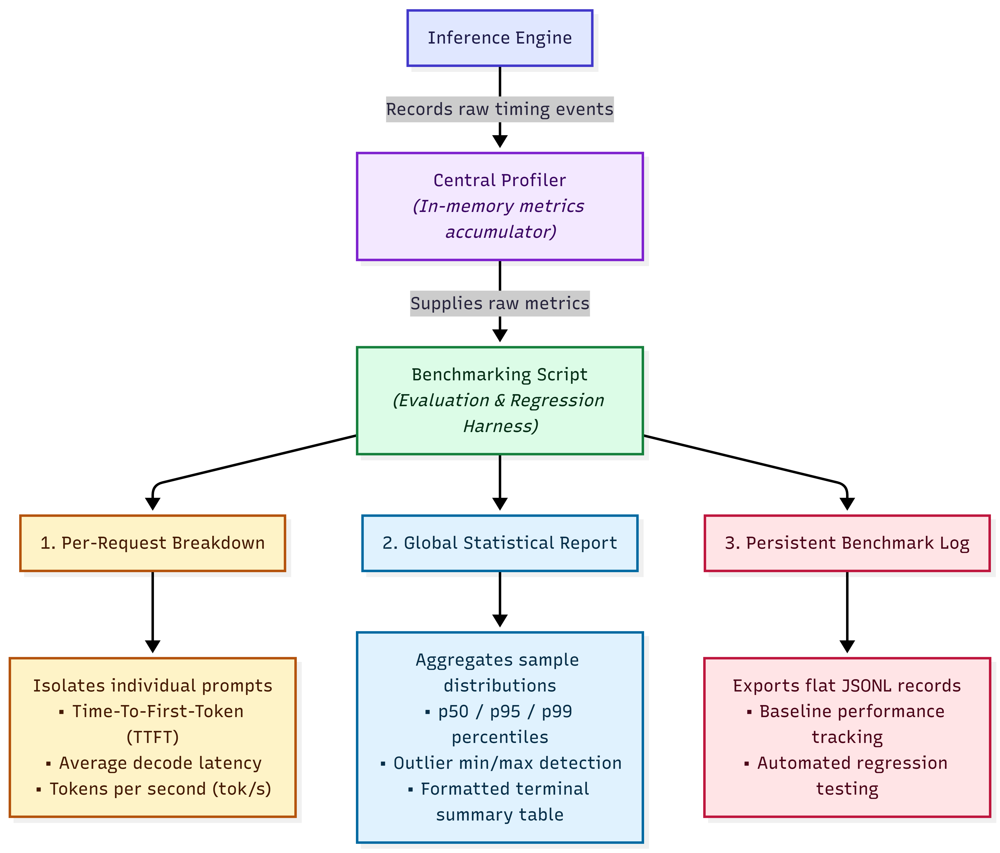

In this worklog, I'll explain how to correctly measure an inference engine's performance and pinpoint hardware or software bottlenecks.

LLM profiling is all about measuring how much time each phase of inference takes, as well as taking note of the memory footprint for ...

## Some context before we start:

When you send a prompt to a model, two phases take place for it to generate a full response. The first phase is called prefill, it's when your whole prompt is passed through the model's parameters once to generate the first token. Think of it as the part where the model is getting to know your prompt and what you want it to do.

The second phase is decode, where we append the generated token and perform another forward pass and so on till the model generates the **End of Sequence (EOS)** token, which signifies that this generated token is the last one in the current response. These series of forward passes happen only on the new token since the Key/Value tensors for every prior token are cached inside the GPU's VRAM instead of recomputed.  

There's also tokenization that takes raw text and converts it into tokens, it's somewhat different for each model, depending on the number of different tokens the model accepts as well as other sorts of things.


.png)


The software that manages all of that is called an inference engine. As we develop & improve inference engines, our only source of truth are numbers we profile before and after the changes we implement or the optimization we implement. 

So now we know that we need to measure the prefill & decode times and also the memory efficiency of our  KV cache if the inference engine is serving more than one user. There's other stuff to measure & keep track of that we'll get into in a short bit.

---
... (talk about what else we will get into, will fill this part at the end)

------

# What we're measuring

We're going to start off by clearly defining what we want to measure:

**Time To First Token (TTFT):** it's the tokenization + prefill phase time
**Time Per Output Token (TPOT):** it's the decode time for one token.
**End-to-End Latency (e2e):** the wall-clock time from request entry till the last token was generated.
**Throughput (Tok/s):** basically equals the number of generated tokens divided by the e2e latency. This metric gives a general feel of the inference speed and inference & serving companies advertise it next to their pricing.

Until this point, everything is simple enough, let's dive into the code.

.png)

This is how we measure the throughput and e2e latency, let's now see what the engine.generate() function does on the inside:


.png)

Reminder that the decode time of one token is the TPOT (Time per output token). The detokenization happens after every forward pass in the decode loop but that's a detail I don't want to take into consideration for now. 

Until now everything seems simple and correct, but unfortunately life is not always flowers and sunshine. In the next part we're going to understand a core part of how LLMs actually run and why profiling using the code shown above gives fake results.


# Timing GPU Code Is Harder Than It Looks


In 2007 Jensen Huang, the founder & CEO of Nvidia, made a huge and risky bet to direct some of their focus to the development of a new programming model that freed their GPUs from being just for computer graphics. They made software that allowed developers to use Nvidia GPUs to do scientific and compute-intensive work. It is only after many years that AI engineers saw the potential and started using it to train and run deep learning models. 

I am of course talking about CUDA. 

CUDA is a huge library that allows the developers to run matrix multiplications and softmax functions using Nvidia's GPUs. The functions that are dispatched to the GPUs that tell it exactly what to do are called kernels.

Kernels are the heart of LLM inference. They are what performs these billions of matrix multiplications efficiently. There's a lot to say about kernels but I'll try to keep it short enough to understand the rest of the text.

So you have general kernels that perform matmuls (matrix multiplications) of any input size, but the more general a kernel is the less optimized it's going to be. There's also kernel fusing, where one kernel does the work of many kernels and takes only the kernel launch overhead of one instead of many. Due to these reasons, many inference engines write & optimize their own kernels. For Stride, the inference engine I'm creating, I use the CUDA kernels that come with PyTorch.

The CPU executing the python code, dispatches the kernel to the GPU and continues with the rest of the python code, and it doesn't wait for the kernel to finish its work. Therefore, the naïve profiling we wrote earlier only recorded the kernel launch overhead of the forward passes.

To correctly measure the inference time, we need to wait at the end of the forward pass and stop the execution of the python code and wait for the GPU to finish the work delegated to it. We do that using ``` torch.cuda.synchronize() ```.

.png)


Let's see the difference when I run the script:


So, the CPU spent the first 502 ms dispatching kernels to the GPU (a forward pass takes more than one kernel), and the GPU kept on executing these kernels till t= 771 ms.


Now since I'm using PyTorch to run the forward pass, it has to do some compilation steps to run the forward pass on the GPU. It first has to select the needed kernels from its wide array of kernels for different neural network operations, and correctly order them. There's also some context initialization that CUDA needs as well as memory allocation and ramping up the clock of our previously idle GPU. For these reasons we must add some warm-up rounds as you saw in the previous code.


(If half a second feels like a lot just to dispatch kernels, you're right. There's more to it than that but that's out of scope. What's important here is that not synchronizing gives you misleading numbers.)

With additional profiling, like the one that's built-in pyTorch's library, we can start to see the different kernels used depending on the model dimensions and the hardware it's running on, the time taken by each step from start to finish and we get something that looks like this:


.png)


This is true profiling where you can pinpoint exactly where the current bottleneck is and what should you go on optimizing. We are not going in that deep though.


We can now start making clean code, collect these datapoints and explore what we can infer from them when we make a benchmarking suite that serves as our regression test and allows us to safely play around our tiny little inference engine.


# Building the Profiling Harness

Instead of cluttering up our engine, we create one profiler class that does all the measurements for us, including the end-to-end, the prefill and the decode times. 

We have our code set up like this:

.png)

(Note: the contextmanager decorator is what allows me to use the "with" clause in my inference engine as you are going to see.)
As you can see if we choose to disable the profiler it will just yield without measuring the time, and of course the overhead for this part is negligible. We can now wrap this function around our operations, say the forward pass of decode loops for example:

.png)

Whenever my engine gets a request and starts to do some work, the profiler keeps on collecting measurements that end up looking like this:

.png)

Congratulations, we now have a collector of measurements that accumulates values, but right now these values don't give us a clear picture of anything actionable yet. Sure we can get an average, but this average is not enough because it's just for one fixed prompt with a fixed length, and we didn't take into account anomalies.

What we need next is something that turns these raw samples into percentiles, runs them across a consistent, varied set of prompts, and logs the result somewhere we can compare run to run. That's what the benchmarking script does.

The script starts off by running a number of warmup rounds, then it runs a series of prompts while isolating each one's values from the accumulator and calculates an average for each prompt. It also calculates global averages as well as the p50, p95 and p99. Each percentile answers a completely different engineering question:

p50: what a typical request looks like
p95: what does bad luck look like
p99: what does the worst-case scenario look like


There are 8 fixed prompts total and here's the list defining the different prompts we are going to use, they are chosen to stress different inference phases:


| **Label**           | **Focus**                                         |
| ------------------- | ------------------------------------------------- |
| short-factual       | Minimal prefill, near-instant EOS                 |
| short-qa            | Short prompt, brief factual answer                |
| medium-explain      | Mid-length prompt, a few sentences of output      |
| medium-code         | Code generation path                              |
| long-reasoning      | Long prompt, multi-step decode                    |
| long-creative       | Long free-form output, stresses decode throughput |
| system-prompt-heavy | Long input to summarise, tests prefill at scale   |
| long-list           | Structured list output, many decode steps         |

Short prompts with short answers isolate TTFT under minimal decode load, long prompts stress prefill, longer generations stress decode. 


The only thing that's missing is to keep track of everything and display the results nicely, and the script does that by exporting the records of runs with some text I attach to the results to keep track of the changes each run introduces. The following is a summary of our profiling system.




Now that everything's set, we can trigger our first profiling run, and we're going to call it "baseline". 

`bash bench "baseline" target-model/run_benchmark.py`

phew.

For the last section we're going to view the report of our run and see what insights we uncover as we read through it.


# Reading The Baseline Results

